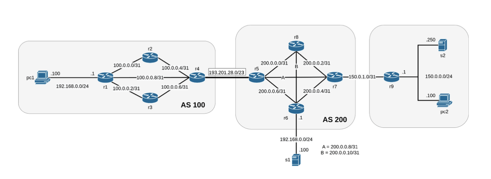

# Network Lab Project with Kathara  

This project is a step-by-step implementation of a complex network topology using **Kathara**, a network emulation tool. The lab includes OSPF, BGP, NAT, firewall configurations, and an OpenVPN setup.  

## Features  

### Network Configurations  
- **OSPF and Static Routing**:  
  - Configured OSPF for routers r6, r7, r8, r9 in the same 0.0.0.0 area.  
  - Implemented static routing on r1, r2, and r3 for full connectivity.  

- **BGP Peering**:  
  - Established BGP between r4 and r5.  
  - AS100 announces `100.0.0.0/24`, and AS200 announces `200.0.0.0/24` and `150.0.0.0/16`.  

### Security Enhancements  
- **NAT and Firewall Rules**:  
  - NAT enabled on r1 and r6 for outgoing traffic.  
  - Firewalls configured on r1 and r6 to block unauthorized traffic, with specific allowances for SSH and OpenVPN.  
  - A firewall rule on r4 blocks all non-SSH forwarded traffic.  

### OpenVPN Setup  
- **Certificates and Authentication**:  
  - Created a Certificate Authority (CA) and certificates for the VPN server and two clients.  
  - Configured OpenVPN with TCP protocol on port 7000 and client-to-client communication.  
  - Assigned specific VPN IP addresses (`10.0.0.100` for pc1, `10.0.0.200` for pc2).  

- **Traffic Capture**:  
  - Captured and analyzed VPN traffic with `netcat` and stored results as `capture_1.pcap`.  

### Additional Features  
- Configured SSH server on s2 with key-based authentication for user `myuser2`.  
- Set up SSH port forwarding to bypass restrictions and reconnect to the VPN.  

## Prerequisites  

- **Kathara**: Install via [official Kathara documentation](https://kathara.org/).  
- **Docker**: Required for running the Kathara lab environment.  
- **Linux Utilities**: `iptables`, `tcpdump`, `netcat` for firewall, traffic generation, and capture.  

## How to Use  

1. **Set Up the Lab**:  
   Clone the repository and initialize the lab:  
   ```bash
   git clone https://github.com/your-username/network-lab.git
   cd network-lab
   kathara lab start
   ```  

2. **Run OpenVPN**:  
   On `s1`, launch the OpenVPN server:  
   ```bash
   openvpn --config vpn_server.conf
   ```  
   On `pc1` and `pc2`, connect to the VPN:  
   ```bash
   openvpn --config vpn_client.conf
   ```  

3. **Generate Traffic**:  
   Use `netcat` to create traffic:  
   ```bash
   # On pc1:
   nc -l -p 8080  
   # On pc2:
   nc <pc1_vpn_ip> 8080  
   ```  

4. **Capture Traffic**:  
   On `r1`, run tcpdump to capture VPN traffic:  
   ```bash
   tcpdump -i eth0 -w /shared/capture_1.pcap  
   ```  

## Image for Reference  

Here’s a representative image to help visualize the topology:  


